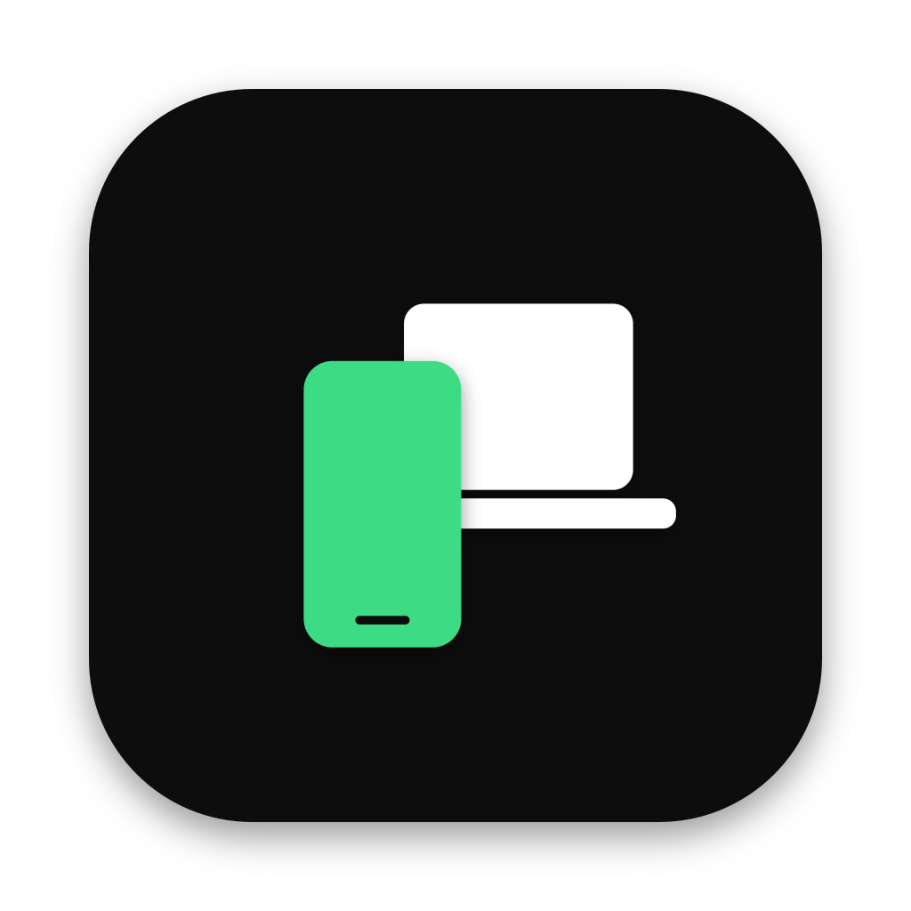

<p align="center">
  
</p>

<h1 align="center">LinkToMac</h1>

A cross-platform companion app for Android phones — mirrors notifications, calls, messages,
photos, files, contacts, and the phone's screen onto your Mac (or Linux), plus native two-way
notes and clipboard sync. Inspired by Microsoft's Phone Link, but not tied to Windows.

Android-only by design: iOS doesn't expose the APIs this app relies on (notification mirroring,
call log/SMS access, screen capture, accessibility-based input injection) to third-party apps.

## Status

Feature-complete and verified against real hardware:

- **Notifications** — mirrored to native OS banners and an in-app list, dismiss from either side
- **Messages** — SMS threads, reply from the desktop, local echo for numbers with no existing thread
- **Contacts** — full create/edit/delete/star, plus call history
- **Photos** — paginated grid, month-grouped, on-demand full-resolution, live refresh when the phone's library changes
- **Files** — full remote file browser: upload/download (double-click to open, or download-and-reveal from the context menu), rename, delete, copy/move, drag-and-drop
- **Screen Mirroring** — live H.264 video decoded in Rust, tap/swipe/key/text input relayed back to the phone
- **Notes** — a native LinkToMac notes feature (deliberately *not* Samsung Notes or Google Keep — neither exposes a public API a third-party app can integrate with); create/edit/delete from either device, synced live
- **Clipboard** — bidirectional sync, plus a combined history view of copies from both devices
- **Settings** — notification banners, clipboard sync, mirroring quality, launch at login, storage management (desktop app); battery-optimization exemption, clipboard sync, about (Android app)
- **Devices** — QR pairing, paired-device management, live connection/battery status

Remaining: packaging (tray icon, signed `.app`/`.deb`/AppImage bundles) and retiring the old
macOS-only `mac-app/` now that `desktop-app/` has full feature parity and adds Linux support.

See [`docs/PLAN.md`](docs/PLAN.md) for the full roadmap and [`docs/PROTOCOL.md`](docs/PROTOCOL.md)
for the wire protocol.

## Structure

```
desktop-app/    Tauri (Rust + React) desktop app — cross-platform (macOS + Linux), actively developed
android-app/    Kotlin companion app (Gradle)
mac-app/        SwiftUI menu-bar app (Swift Package Manager) — macOS-only predecessor, superseded by desktop-app/
assets/         App icon source (SVG, both platforms, dark/light) and regeneration steps
docs/           Protocol and planning docs
```

## Desktop app

Requires Node.js and a Rust toolchain.

```bash
cd desktop-app
npm install
npm run tauri dev
```

## Android app

Requires Android Studio (recommended — it manages its own SDK and JDK) or a manually installed
Android SDK + JDK 17/21 on `PATH`. The bundled Gradle wrapper (pinned to Gradle 9.4.1 + AGP 8.6.0)
has been verified to configure correctly; it stops at the expected `SDK location not found` error
without a real Android SDK present, which Android Studio resolves automatically on first open.

```bash
cd android-app
./gradlew installDebug
```

Open the app, grant the requested permissions (notification listener, call log/SMS, photos, file
access, and — only needed for screen-mirroring input — accessibility access), then use the
**Device** tab's "Scan Pairing Code" and scan the QR shown in the desktop app's "This Device"
section.

## Mac app (predecessor, macOS only)

Requires Xcode 16 / Swift 6 toolchain, macOS 14+. Kept for reference during the `desktop-app/`
transition; not where new feature work happens.

```bash
cd mac-app
Scripts/run.sh
```

**Don't use `swift run` or Xcode's Run button directly** — a bare, bundle-less executable gets
registered by Launch Services as `BackgroundOnly`, which means `MenuBarExtra` never gets a real
WindowServer session and its status item silently never appears (no crash, no error — it just
doesn't show up). `Scripts/run.sh` builds the executable, wraps it in a minimal ad-hoc signed
`LinkToMac.app` (with a real bundle identifier and `LSUIElement` set so there's no Dock icon), and
opens that instead. This also makes native notification banners work, since `UserNotifications`
has the same bundle-identity requirement. Pass `release` as an argument for a release build
(`Scripts/run.sh release`).

## Pairing & security

1. The Mac/Linux app has one stable P-256 identity key pair (generated once, persisted) and
   renders a QR code with its LAN address, device id, and a one-time pairing token —
   deliberately *not* its public key, which would make the QR too dense to scan reliably (see
   [`docs/PROTOCOL.md`](docs/PROTOCOL.md)).
2. The Android app scans the QR, opens a WebSocket to the desktop app, and generates a fresh
   ephemeral P-256 key pair for the session. The desktop app immediately sends its public key
   over that socket (`serverHello`). Both sides then derive a shared AES-256-GCM session key via
   ECDH + HKDF (salted with the pairing token). No key material or long-term secret ever crosses
   the wire.
3. All messages after that handshake are encrypted with the session key.
4. On successful pairing, the desktop app issues a persistent device token; the Android app
   stores it in `EncryptedSharedPreferences` (Android Keystore-backed) and presents it on
   reconnect (discovered via Bonjour/NSD/mDNS) so you don't have to re-scan the QR every time.
   Each reconnect still performs a fresh ECDH exchange for forward secrecy, and pins the desktop
   app's public key against the one learned during original pairing — the device token only
   skips the manual approval step.
5. The WebSocket transport itself is plain `ws://` (cleartext), not `wss://`/TLS — Android's
   default network security policy blocks that, so the app opts in via
   `android:usesCleartextTraffic="true"`. This is intentional, not an oversight: security comes
   from the app-layer ECDH+AES-GCM encryption in steps 2–3, not from transport TLS, and traffic
   never leaves the LAN by design. Standing up a real TLS listener would need a self-signed cert
   generated and pinned on first pairing for no real security gain here.
